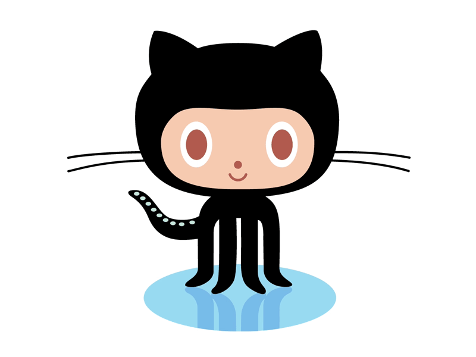

  <!-- Animated GitHub Icon -->
  

<h1 align="center">
  
</h1>

  <strong>🚀 A Passionate Full Stack Developer & AI/ML Enthusiast from India 🇮🇳</strong>

---

## 🎯 About Me

- 🔭 Working on **AI/ML Projects & Full Stack Applications**  
- 🌱 Learning **Advanced Machine Learning & Cloud Technologies**  
- 👯 Open to collaborating on **Open Source Projects**  
- 💬 Ask me about **Python, JavaScript, React, AI/ML**
- 🔗 Portfolio:  [vikash-shaw-portfolio.vercel.app](https://vikash-shaw-portfolio.vercel.app/)
- 📫 Reach me: [Vikashshaw013@gmail.com](mailto:Vikashshaw013@gmail.com)  
- ⚡ Fun fact: **The first computer bug was an actual moth! 🐛**

---

## 🌐 Connect with Me

  
  
  
  
  
  

---

## 🛠️ Languages & Tools

  

<!--
<!-----

<!--## 📊 GitHub Stats

  
  

---
-->

<!--
-->
<!--   <picture> -->
    
<!--     <source media="(prefers-color-scheme: dark)"
            srcset="https://raw.githubusercontent.com/codebyvs/codebyvs/main/dist/github-contribution-grid-snake-dark.svg" /> -->
    
<!--      -->
<!--   </picture> -->
<!-- 
 -->

---

  
  &nbsp;

---

<h3 align="center">
  
</h3>
